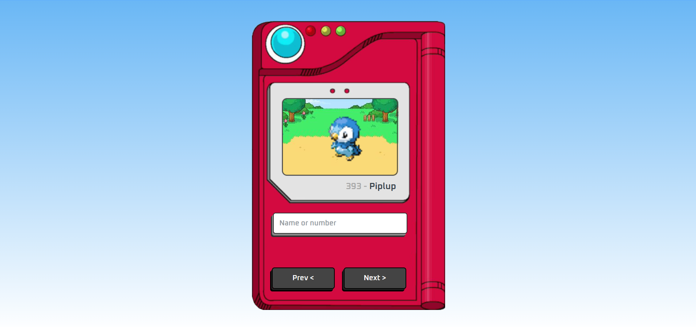

# Pokédex

An interactive **Pokédex** built with **HTML**, **CSS**, and **JavaScript**, consuming data from the **PokéAPI**. Search Pokémon by name or number, browse through them using navigation buttons, and view their official artwork.

## Preview



## Features

- 🔍 Search Pokémon by name or Pokédex number
- ⬅️➡️ Navigate between Pokémon
- 🖼️ Display official Pokémon artwork
- 📋 Show Pokémon name and Pokédex number
- 📱 Responsive interface
- 🌐 Data fetched from the PokéAPI

## Built With

- HTML5
- CSS3
- JavaScript (ES6+)
- PokéAPI

## What I Learned

This project helped me practice:

- DOM manipulation
- Asynchronous JavaScript (`fetch`, `async`/`await`)
- REST API consumption
- Event handling
- Responsive web design
- Front-end project organization

## Getting Started

1. Clone the repository:

```bash
git clone https://github.com/kemillymotta/pokedex.git
```

2. Navigate to the project folder:

```bash
cd pokedex
```

3. Open `index.html` in your browser or run the project using the **Live Server** extension in Visual Studio Code.

## Project Structure

```
pokedex/
│
├── css/
│   └── style.css
├── js/
│   └── script.js
├── images/
├── favicons/
├── index.html
└── README.md
```

## API

This project uses the **PokéAPI** to retrieve Pokémon data.

https://pokeapi.co/

## Acknowledgements

This project was developed for learning purposes and was inspired by the **Manual do Dev** Pokédex tutorial.
